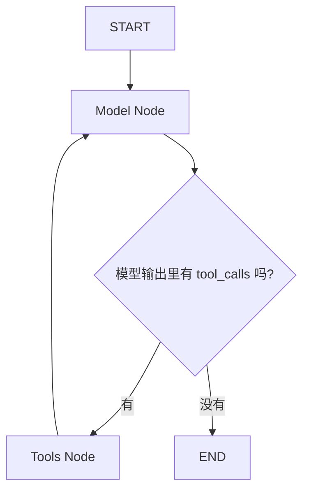
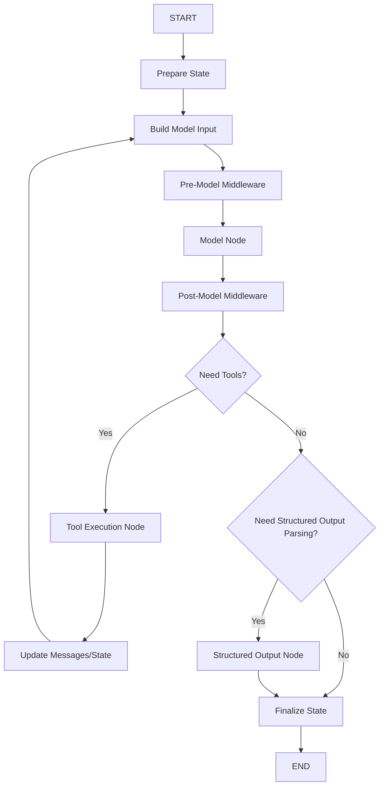
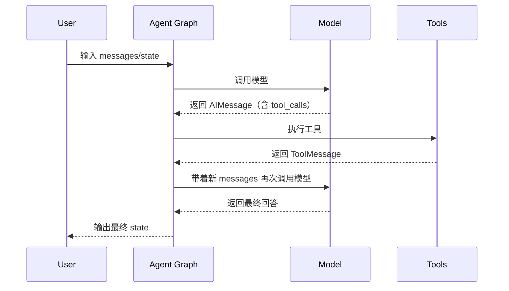
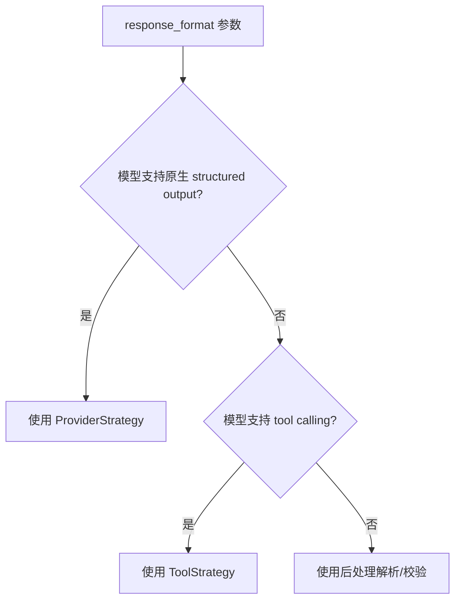
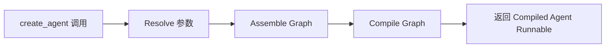
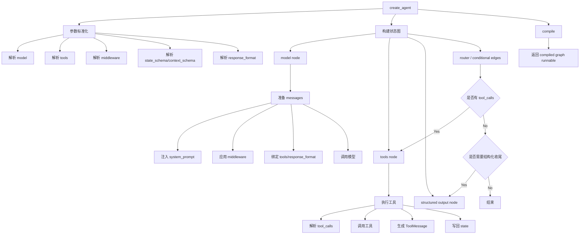

下面我讲的是 **`langchain.agents.create_agent` 的内部实现思路**，不是用法。

先说明两点：

1. 你说的 `creat_agent` 应该是 `create_agent`
2. **新版 LangChain 的 `create_agent` 本质上已经不是“老式 AgentExecutor 工厂”了，而是一个“LangGraph 图工厂”**
   也就是说，它的核心工作不是“直接写一个 while 循环去跑 agent”，而是：

- 先整理参数
- 再构建一个状态图（graph）
- 再把这个图编译成一个可执行对象
- 最后返回这个 graph runnable

所以理解它最好的方式，不是把它看成“一个函数”，而是把它看成：

> `create_agent(...) = 根据 model / tools / middleware / schema 配置，拼装出一个带状态循环的 LangGraph`

---

# 一、先给你一个总览

`create_agent` 大致做的事情可以压缩成一句话：

```text
把“模型调用 + 工具调用 + 消息状态 + 路由判断 + 中间件 + 结构化输出”
组装成一个状态机，并返回可 invoke / stream 的编译后图对象。
```

它内部不是简单的：

```python
def create_agent(...):
    while True:
        model(...)
        if tool_calls:
            run_tools(...)
        else:
            break
```

而更接近：

```python
def create_agent(...):
    model = normalize_model(...)
    tools = normalize_tools(...)
    middleware = normalize_middleware(...)
    state_schema = resolve_state_schema(...)
    response_format = resolve_response_format(...)

    graph = StateGraph(state_schema)
    graph.add_node("model", model_node)
    graph.add_node("tools", tools_node)
    graph.add_conditional_edges("model", router)
    graph.add_edge("tools", "model")

    return graph.compile(...)
```

---

# 二、它返回的到底是什么

这是理解实现的第一关键点。

新版 `create_agent(...)` 返回的通常不是以前那种老的 executor，而是：

- 一个 **编译后的 LangGraph runnable**
- 支持：
  - `.invoke(...)`
  - `.stream(...)`
  - `.batch(...)`
- 并且可以天然结合：
  - checkpoint
  - interrupt
  - memory
  - human-in-the-loop
  - state persistence

所以从实现角度说：

> `create_agent` 是 LangChain 提供给用户的“高级入口”，但底层执行框架是 LangGraph。

---

# 三、create_agent 的核心实现分层

我建议你把它拆成 6 层来理解：

---

## 第 1 层：参数标准化

`create_agent` 接收的参数通常不少，比如：

- `model`
- `tools`
- `system_prompt`
- `middleware`
- `response_format`
- `state_schema`
- `context_schema`
- `checkpointer`
- `store`
- `interrupt_before`
- `interrupt_after`
- `debug`
- `name`
- 以及一些 graph/runtime 相关配置

### 它做的第一件事：统一这些输入

因为用户传进来的东西形式可能很多：

#### 1）model 可能是

- 字符串模型名
- ChatModel 实例
- 已经包过工具的模型
- 可运行对象（runnable-like）

所以内部要先做：

- model 解析
- model 能力判断
- 是否支持 tool calling
- 是否支持 structured output
- 是否需要包装

---

#### 2）tools 可能是

- `@tool` 修饰的函数
- `BaseTool`
- 普通 python callable
- 已经是 tool schema 的对象

内部要统一成一个标准工具表，至少要能支持：

- 工具名称
- 参数 schema
- 实际调用入口
- 工具描述
- 工具返回结果转消息的方式

---

#### 3）middleware 可能是

- 空
- 一个 middleware
- 多个 middleware
- 不同 middleware 实现不同 hook

所以也要统一为一个 middleware pipeline。

---

#### 4）response_format 可能是

- `None`
- Pydantic 模型
- JSON schema
- provider-native structured output 策略
- tool-calling structured output 策略

所以内部还要先决定：

> 最终结构化输出是靠模型原生能力做，还是靠“伪装成工具”来做，还是做额外验证。

---

# 四、第二层：状态 schema 的构建

这一步很重要。

Agent 不是一次性的函数调用，而是一个多轮循环的状态机。
所以内部必须先定义 **state**。

典型 state 至少包含：

- `messages`
- 可能的工具执行结果
- 中间件增加的字段
- 结构化输出字段，比如 `structured_response`
- 用户自定义 state 字段

如果你传了 `state_schema`，那么 `create_agent` 会把它作为图状态的基础结构。

例如概念上像这样：

```python
class AgentState(TypedDict):
    messages: list
    structured_response: Any | None
```

如果你自定义：

```python
class CustomAgentState(AgentState):
    preference: str
```

那么 graph state 就会变成：

- 默认 agent 字段
- 加上你的 `preference`

### 这背后的实现意义

因为 LangGraph 的核心就是：

> 每个 node 接收 state，输出 state patch，然后 graph 合并 state

所以 `create_agent` 在本质上其实是在先定义：

```text
这个 agent 的“共享状态容器”是什么样
```

---

# 五、第三层：消息预处理与 system_prompt 注入

很多人以为 `system_prompt` 是个很简单的参数，实际上从实现角度它不是独立执行节点，而更像 **消息构建阶段的一部分**。

也就是说内部不是：

```text
system_prompt 节点 -> model 节点
```

更常见的是：

- 先从 state 中取出 `messages`
- 如果有 `system_prompt`，把它插入消息序列前部
- middleware 再可能继续改写消息
- 然后把“最终消息列表”发给 model

所以你可以把它理解为：

```text
raw state messages
    ↓
prepend system prompt
    ↓
apply middleware transforms
    ↓
final model input messages
```

---

# 六、第四层：构建核心 graph

这是 `create_agent` 最核心的实现。

它内部会构造一个类似下面的状态图。

---

## 最简版流程图



这是最基础的 agent loop。

---

## 带 system prompt / middleware / structured output 的更完整图



这张图更接近真实实现思路。

---

# 七、第五层：model node 是怎么工作的

这是 agent 的大脑。

`model node` 的职责通常不是“单纯调用 LLM”这么简单，而是至少包括：

1. 从 state 取出 messages
2. 注入 system prompt
3. 结合 middleware 修改输入
4. 把 tools schema 绑定到模型（如果模型支持 tool calling）
5. 调用模型
6. 把模型输出转换成标准消息对象
7. 写回 state

概念上很像：

```python
def model_node(state, runtime):
    messages = state["messages"]
    messages = apply_system_prompt(messages)
    messages = apply_before_model_middleware(messages, state, runtime)

    response = model.invoke(
        messages,
        tools=tool_schemas_if_needed,
        response_format=resolved_response_format_if_needed,
    )

    response = apply_after_model_middleware(response, state, runtime)

    return {
        "messages": state["messages"] + [response]
    }
```

当然真实实现会更复杂，但核心就是这个。

---

## model node 的关键点：它必须识别“这次输出是不是工具调用”

在支持 tool calling 的模型里，模型输出不一定是最终自然语言回答，也可能是：

- 一个或多个 tool calls
- 最终回答
- 结构化结果
- 某种 provider-specific message format

所以 model node 执行后，graph 不能立刻结束，而要进入 **路由判断**。

---

# 八、第六层：路由函数 / 条件边

这是 graph 风格的核心：**不是 if 写在主循环里，而是变成条件边**。

通常会有一个 router 逻辑，大意是：

```python
def route_after_model(state):
    last_message = state["messages"][-1]
    if last_message.tool_calls:
        return "tools"
    return "__end__"
```

如果支持 structured output，路由逻辑会更复杂一点：

```python
def route_after_model(state):
    last_message = state["messages"][-1]

    if has_tool_calls(last_message):
        return "tools"

    if needs_structured_output_validation(state):
        return "structured_output"

    return "__end__"
```

所以 graph 不是硬编码 while，而是：

- model 节点执行完
- router 看最后输出
- 决定下一个节点是谁

---

# 九、tools node 是怎么实现的

当模型输出 tool calls 后，graph 就进入 tool node。

这个 node 的职责通常是：

1. 解析模型输出中的 tool calls
2. 按名字匹配注册工具
3. 校验参数
4. 调用实际工具函数
5. 把结果包装成 tool message
6. 写回 state.messages
7. 返回给 graph，进入下一轮 model

概念上像这样：

```python
def tools_node(state, runtime):
    last_ai_message = state["messages"][-1]
    tool_calls = extract_tool_calls(last_ai_message)

    tool_messages = []
    for call in tool_calls:
        tool = tools_by_name[call["name"]]
        result = tool.invoke(call["args"], runtime=runtime)
        tool_messages.append(
            ToolMessage(
                content=serialize(result),
                tool_call_id=call["id"],
                name=call["name"]
            )
        )

    return {
        "messages": tool_messages
    }
```

注意这里有个实现思想：

> 工具结果不是“偷偷传回模型”，而是被写入 agent state 里的 messages 中，变成对话历史的一部分。

这非常关键，因为下一轮模型调用看到的是：

- 用户问题
- 上一轮 AI 发起的 tool call
- 工具返回的 tool result

于是模型才能继续推理。

---

# 十、为什么工具执行后还要回到 model

因为 tool 只是“获取外部信息”，不是最终推理者。

所以流程永远是：

```text
model 决定要不要调工具
→ tools 执行工具
→ 把结果塞回消息历史
→ 再交给 model 继续思考
```

这就是典型 ReAct / tool-augmented loop。

---

## 这个循环的 mermaid 图



---

# 十一、middleware 在实现里扮演什么角色

这是新版 `create_agent` 很值得研究的一点。

老式 agent 往往只有 callback。
新版 agent 更偏向 middleware 组合。

middleware 可以参与：

- model 调用前
- model 调用后
- tool 调用前后
- state 扩展
- context 注入
- guardrail
- interrupt
- debug tracing

所以实现上，`create_agent` 往往要做两类事情：

---

## 1）收集中间件能力

比如某个 middleware 实现了：

- before_model
- after_model
- wrap_tool_call
- modify_state_schema
- modify_context_schema

那么 create_agent 在图构建前要先把这些能力“登记”出来。

概念上像：

```python
for mw in middleware:
    if mw.has_before_model():
        before_model_hooks.append(mw.before_model)
    if mw.has_after_model():
        after_model_hooks.append(mw.after_model)
    if mw.has_tool_wrapper():
        tool_wrappers.append(mw.wrap_tool_call)
```

---

## 2）把这些能力接进图里

有两种常见实现方式：

### 方式 A：作为独立 node
比如：

- pre_model node
- post_model node

### 方式 B：作为 node wrapper
比如：

- model node 外面包 middleware
- tools node 外面包 wrapper

从架构设计上说，B 通常更优雅一些；但具体版本实现可能混合使用。

---

# 十二、context_schema 和 ToolRuntime 是怎么接进去的

你现在在学 LangChain agent，这块很关键。

如果你传了：

- `state_schema`
- `context_schema`

那么内部 graph 其实不只是拿一个 messages list 在跑，而是运行在：

```text
(state, runtime context)
```

的组合之上。

比如工具函数里你可以拿到：

- `runtime.state`
- `runtime.context`

这意味着在工具执行节点里，调用工具不是简单：

```python
tool.invoke(args)
```

而更像：

```python
tool.invoke(args, runtime=tool_runtime)
```

其中 `tool_runtime` 里会包含：

- 当前 graph state
- 当前 context
- store/checkpointer/runtime info

所以从实现上说：

> `create_agent` 不只是建立“消息流”，还建立了“运行时环境注入机制”。

---

# 十三、response_format / structured output 的内部实现

这部分也是新版 create_agent 的重点。

如果传了：

```python
response_format=SomePydanticModel
```

那 create_agent 不只是最后简单 `json.loads` 一下。

它通常会先决定策略：

---

## 可能的几种策略

### 1）ProviderStrategy
如果模型原生支持结构化输出，比如 provider 能保证 schema adherence，那优先直接让模型按 schema 输出。

### 2）ToolStrategy
如果模型更擅长 tool calling，就可能把“生成结构化结果”包装成一种特殊工具调用。

### 3）后处理验证
模型先输出文本/JSON，再做 schema 校验。

---

## 实现流程可以理解为



---

## 为什么这一步在 create_agent 里做，而不是用户自己做？

因为它影响的是：

- model node 的绑定方式
- router 的退出条件
- final state 的结构
- `structured_response` 字段是否写入 state

也就是说它会改变 graph 的结构与输出契约，所以必须在工厂阶段决定。

---

# 十四、最终状态怎么结束

agent 什么时候结束？

最常见的退出条件是：

### 情况 1：模型这轮没有生成 tool call
说明它认为自己已经能回答了，可以结束。

### 情况 2：模型生成了符合 schema 的结构化输出
说明结果已经成型，可以结束。

### 情况 3：触发了中断/人工介入/最大步数等控制逻辑
这时可能暂停、报错、或等待外部继续。

---

## 结束阶段通常会做什么

- 保证最后消息已经写进 state
- 如果有 structured output，则写入 `structured_response`
- 保证返回的 state 符合 schema
- 返回整个 graph state，而不是只返回一句文本

所以你平时看到：

```python
res = agent.invoke({...})
```

得到的往往是一个字典型 state，而不只是字符串。

---

# 十五、你可以把 create_agent 理解成“声明式构建 agent”

这是它和老架构最核心的差别。

老方式更像：

```python
agent = SomeAgent(llm, tools, prompt)
executor = AgentExecutor(agent=agent, tools=tools)
```

这是“命令式组装”。

新版 `create_agent` 更像：

```python
agent = create_agent(
    model=...,
    tools=...,
    middleware=...,
    state_schema=...,
    response_format=...,
)
```

内部不是创建一个 executor 对象去 while-loop，而是：

```text
声明 agent 由哪些节点、哪些边、哪些状态组成
然后 compile 成 graph runnable
```

所以从软件架构上，它更像一个 **DSL 工厂**。

---

# 十六、一个更贴近内部实现的伪代码

下面这个伪代码比较接近新版 `create_agent` 的真实设计精神：

```python
def create_agent(
    model,
    tools=None,
    system_prompt=None,
    middleware=None,
    response_format=None,
    state_schema=None,
    context_schema=None,
    checkpointer=None,
    store=None,
    interrupt_before=None,
    interrupt_after=None,
    debug=False,
    name=None,
):
    # 1. 标准化输入
    model = resolve_model(model)
    tools = resolve_tools(tools or [])
    middleware = resolve_middleware(middleware or [])
    state_schema = resolve_state_schema(state_schema, middleware, response_format)
    context_schema = resolve_context_schema(context_schema, middleware)
    response_strategy = resolve_response_format(response_format, model)

    # 2. 构造基础节点
    def model_node(state, runtime):
        messages = state["messages"]
        messages = prepend_system_prompt(messages, system_prompt)
        messages = apply_before_model_hooks(messages, state, runtime, middleware)

        bound_model = bind_tools_and_response_format(
            model=model,
            tools=tools,
            response_strategy=response_strategy,
        )
        ai_msg = bound_model.invoke(messages)

        ai_msg = apply_after_model_hooks(ai_msg, state, runtime, middleware)
        return {"messages": [ai_msg]}

    def tools_node(state, runtime):
        last_msg = state["messages"][-1]
        tool_calls = extract_tool_calls(last_msg)
        tool_results = execute_tool_calls(tool_calls, tools, runtime, middleware)
        return {"messages": tool_results}

    def router(state):
        last_msg = state["messages"][-1]
        if has_tool_calls(last_msg):
            return "tools"
        if needs_structured_output_finalization(state, response_strategy):
            return "structured_output"
        return "__end__"

    def structured_output_node(state, runtime):
        structured = finalize_structured_output(state, response_strategy)
        return {"structured_response": structured}

    # 3. 建图
    graph = StateGraph(state_schema, context_schema=context_schema)
    graph.add_node("model", model_node)

    if tools:
        graph.add_node("tools", tools_node)

    if response_strategy:
        graph.add_node("structured_output", structured_output_node)

    graph.add_edge("__start__", "model")
    graph.add_conditional_edges("model", router)

    if tools:
        graph.add_edge("tools", "model")

    if response_strategy:
        graph.add_edge("structured_output", "__end__")

    # 4. 编译
    return graph.compile(
        checkpointer=checkpointer,
        store=store,
        interrupt_before=interrupt_before,
        interrupt_after=interrupt_after,
        debug=debug,
        name=name,
    )
```

这不是源码逐字版，但从架构理解上已经非常接近了。

---

# 十七、为什么 LangChain 要把 create_agent 设计成这样

因为老式 agent executor 有几个天然问题：

### 1）状态扩展困难
你很难优雅地给 agent 增加自定义字段、结构化状态、外部上下文。

### 2）中断与恢复困难
如果是普通 while 循环，要做 checkpoint / resume / HITL 很麻烦。

### 3）middleware 不好组合
before/after model、before/after tools、guardrails 很容易越写越乱。

### 4）可视化和调试差
graph 比 loop 更容易调试和追踪。

### 5）和 LangGraph 生态割裂
而现在 LangChain 明显在往 LangGraph 靠。

所以 `create_agent` 的现代实现，本质上是：

> 用 LangChain 保留易用入口，用 LangGraph 提供真实执行内核。

---

# 十八、你可以把整个 create_agent 看成三个阶段

---

## 阶段 1：Resolve
解析并标准化所有输入

- model
- tools
- middleware
- schema
- structured output strategy

---

## 阶段 2：Assemble
组装 graph

- 定义 state
- 定义 node
- 定义 router
- 定义 edge
- 定义终止条件

---

## 阶段 3：Compile
编译 graph

- 挂 checkpointer
- 挂 store
- 挂 interrupt 配置
- 挂 debug / name
- 返回 runnable

---

## 这三个阶段的 mermaid 图



---

# 十九、如果你去读源码，最该盯住什么

如果你真准备啃源码，我建议按下面顺序读，不要一上来就陷在细节里：

---

## 1）先看 create_agent 的函数签名
先弄清参数面。

重点看：

- model
- tools
- middleware
- response_format
- state_schema
- context_schema
- checkpointer / store / interrupt

---

## 2）看它调用了哪些 helper
重点不是先看每个 helper 内部，而是先看主流程。

你要先建立一个“工厂骨架图”：

```text
create_agent
 ├─ resolve model
 ├─ resolve tools
 ├─ resolve middleware
 ├─ resolve schemas
 ├─ build model node
 ├─ build tools node
 ├─ add router
 └─ compile graph
```

---

## 3）重点读 router
很多 agent 实现的灵魂其实在 router。

它决定：

- 什么时候进工具
- 什么时候结束
- 什么时候进 structured output
- 什么时候中断

---

## 4）重点读 model node
你会看到很多复杂性都集中在这里：

- 消息准备
- prompt 注入
- 工具绑定
- structured output 绑定
- middleware hook
- 输出格式统一

---

## 5）再看 tools node
这一层相对没那么抽象，通常就是：

- 解析 tool calls
- 查工具
- 执行
- 写回消息

---

# 二十、一个完整的脑图式总结



---

# 二十一、最核心的一句话总结

如果让我只用一句话概括 `create_agent` 的实现：

> `create_agent` 不是“帮你创建一个提示词 + executor”，而是“把模型、工具、状态、路由、中间件和结构化输出拼成一个 LangGraph 状态机，然后 compile 成可执行 agent”。`

---

# 二十二、再给你一个“源码阅读时的心法”

你读这个函数时，最好一直带着下面这个问题：

> “这一段代码是在做参数解析，还是在做图装配，还是在做运行时执行？”

因为 `create_agent` 的代码读起来容易乱，就是因为这三类逻辑交织在一起。

你可以强行分类：

- **Resolve 类代码**：在统一输入
- **Build 类代码**：在造节点、造边、造路由
- **Runtime 类代码**：在定义节点执行逻辑

一旦这么分层，源码会清楚很多。

---

如果你愿意，我下一条可以继续直接给你做两件事之一：

1. **按“接近源码”的方式，逐段拆解 `create_agent` 的内部模块与执行路径**
2. **结合你项目里 `Langchain_Learning/about_create_agent_*.py` 这些示例，反推每个参数在内部实现里是怎么生效的**

如果你想要，我还可以继续补一版：

- **“带伪源码注释版 create_agent 实现拆解”**
- 或者 **“create_agent 与 create_react_agent / AgentExecutor 的架构差异图”**